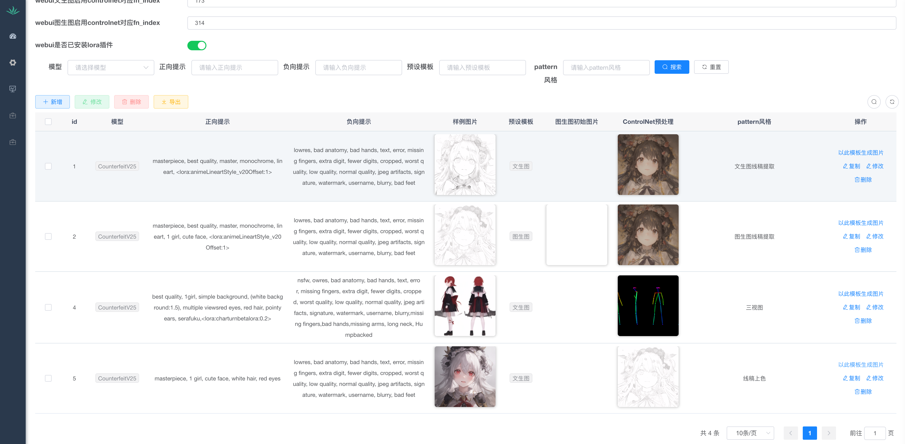
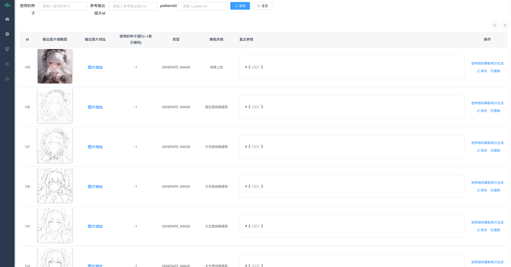

# UI-Admin

Stable Diffusion WebUI Admin, 本项目基于Ruoyi-Vue进行二次开发，base on https://gitee.com/y_project/RuoYi-Vue

## 团队主页

如果你有兴趣参与开发或者有好的想法想要提出，也可以通过我们的[团队主页](http://alpgoai.com/)找到我们的联系方式（QQ群）

## 功能介绍
- 目前提供 `风格模板` 和 `输出图片` 的管理功能
- 在 `webui` 地址处填写你的服务地址即可调用服务生成图片，比如`autodl`的自定义服务地址
- 因为需要调用 `webui` 的`api`，请确保您开启了`webui`的`api`调用功能

### Stable Diffustion 风格模板管理
- 创建一个风格模板，填写参数，保存
  - 目前只支持部分参数，其他参数计划后续支持，你可以在 [Issue](https://github.com/ALPGO-AI/ui-admin/issues) 中提 [Feature Request](https://github.com/ALPGO-AI/ui-admin/issues/new?assignees=&labels=&template=ISSUE_TEMPLATE_1.md) 让我们知道哪些参数应该优先支持
  - 如果图片生成时报错，请在[Issue](https://github.com/ALPGO-AI/ui-admin/issues) 中提 [Bug Report](https://github.com/ALPGO-AI/ui-admin/issues/new?assignees=&labels=&template=ISSUE_TEMPLATE_2.md) 并尽可能提供详细的复现步骤，以便让开发更快更好的定位问题
  - 如果你有兴趣参与开发，也可以通过我们的[团队主页](http://alpgoai.com/)找到我们的联系方式（QQ群）
  - 目前支持ControlNet，但是要求使用的WebUI服务需要已经安装好ControlNet插件
- 上方的WebUI相关信息需要填写，fn_index的值可以在WebUI页面上点击按钮时发送的API请求参数中找到，目前暂时没有自动获取的方案，请先手动填写
- 点击以此模板生成图片，后端会调用对应服务的 `/api/predict` api，进行文转图功能的使用
- `api` 返回生成的图片后，会异步上传到`腾讯云COS`，相关配置请配置环境变量或修改配置文件 `alpgo-admin/src/main/resources/application.yml` 中的参数，目前暂未支持其他图床服务

- 

### Stable Diffustion 输出图片管理

- 风格模板生成的图片会展示在这里，也可以快速使用相同模板再次生成，使用方法同上

- 

### 系统功能

- 默认注册功能不开放，可以在 系统管理 > 参数设置 里按需修改，注册用户默认没有角色，也就没有菜单权限，需要管理员手动赋予权限
- 登录验证码功能默认开启，可以在 系统管理 > 参数设置 里按需修改

### 项目CI

本项目使用 Coding 进行构建和部署，https://alpgo.coding.net/p/alpgo-ai/ci/job

| Service | Status |
| ------- | ------ |
| Frontend| [](https://alpgo.coding.net/p/alpgo-ai/ci/job)|
| Backend | [](https://alpgo.coding.net/p/alpgo-ai/ci/job)|

## 本地开发

### 前端启动

1. 需要安装node开发环境和npm
2. 进入前端项目目录安装依赖并启动

    ```
    cd alpgo-ui

    npm install

    npm run dev
    ```
3. 如果你准备将前端部署在域名网站上，可以在vue的环境配置 .env 相关文件中修改备案号
    ```
    # 备案号
    VUE_APP_BACKUP_NO=备案号
    ```
### 后端启动

1. 需要 maven 环境，最好使用 idea 进行开发
1. 准备好 mysql 数据库后，请配置环境变量或修改 `alpgo-admin/src/main/resources/application-druid.yml` 中的参数
    ```
    druid:
        # 主库数据源
        master:
            url: jdbc:mysql://${MYSQL_HOST}:${MYSQL_PORT}/${MYSQL_DB_NAME}?useUnicode=true&characterEncoding=utf8&zeroDateTimeBehavior=convertToNull&useSSL=true&serverTimezone=GMT%2B8
            username: ${MYSQL_USERNAME}
            password: ${MYSQL_PASSWORD}
        # 从库数据源
    ```
1. 准备好 redis 服务后，请配置环境变量 `alpgo-admin/src/main/resources/application.yml` 中的参数
    ```
    # redis 配置
    redis:
        # 地址
        host: ${REDIS_HOST}
        # 端口，默认为6379
        port: ${REDIS_PORT}
        # 数据库索引
        database: 0
        # 密码
        password: ${REDIS_PASSWORD}
    ```
1. 准备好腾讯云 COS 服务后，请配置环境变量 `alpgo-admin/src/main/resources/application.yml` 中的参数
    ```
    # 腾讯云cos配置
    cosApiSecretId: ${COS_API_SECRET_ID}
    cosApiSecretKey: ${COS_API_SECRET_KEY}
    cosApiBucketName: ${COS_API_BUCKET_NAME}
    cosApiRegion: ${COS_API_REGION}
    ```
1. 使用 maven 安装依赖并启动
    ```
    mvn install

    mvn spring-boot:run
    ```
